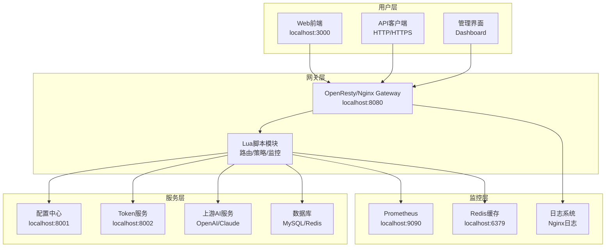
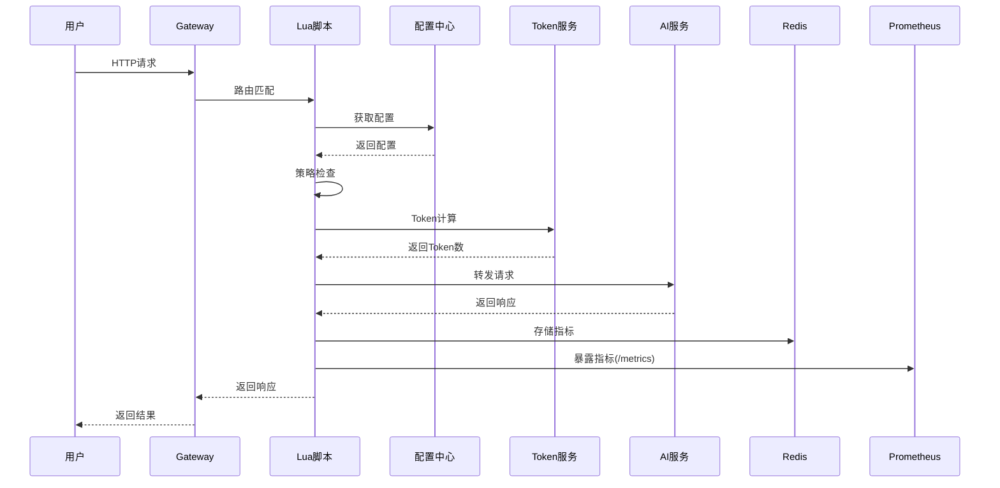
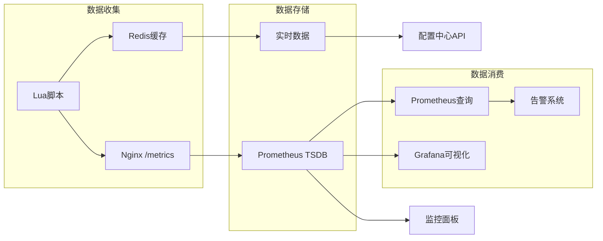
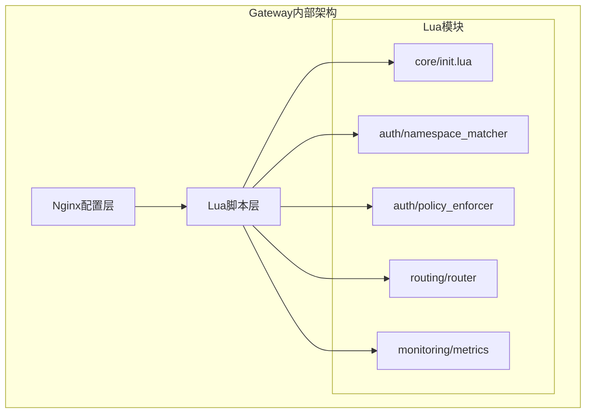

# AI Gateway 架构图

## 🏗️ 整体架构

## 🔄 数据流向

## 📊 监控架构

## 🏛️ 组件详细架构

## 🔧 端口映射

| 服务 | 端口 | 说明 |
|------|------|------|
| Gateway | 8080 | 主服务入口 |
| 配置中心 | 8001 | 配置管理API |
| Token服务 | 8002 | Token计算服务 |
| 前端 | 3000 | Web管理界面 |
| Prometheus | 9090 | 监控数据查询 |
| MySQL | 3307 | 数据库 |
| Redis | 6379 | 缓存 |

## 📈 关键指标

### 业务指标
- `gateway_requests_total`: 总请求数
- `gateway_requests_success_total`: 成功请求数
- `gateway_requests_failed_total`: 失败请求数

### 性能指标
- `gateway_request_duration_seconds`: 请求持续时间
- `gateway_upstream_duration_seconds`: 上游响应时间

### 系统指标
- `gateway_up_time_seconds`: 网关运行时间
- `gateway_upstream_requests_total`: 上游请求数

## 🎯 架构特点

1. **微服务架构**: 各组件独立部署
2. **动态配置**: 通过配置中心管理
3. **实时监控**: 完整的监控体系
4. **高可用**: 支持负载均衡和故障转移
5. **可扩展**: 支持水平扩展
